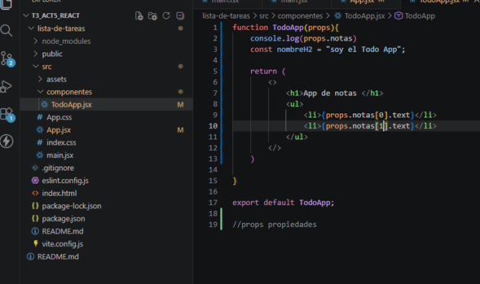

# React + Vite


Las props son datos de solo lectura que se pasan de un componente padre a uno hijo, los datos que reciibe no los puede sobreescribir . El state (estado) es el conjunto de datos internos y mutables que un componente gestiona por sí mismo. 

ejemplo del video: https://youtu.be/2xhAcqhSuVU
props


estados


¿Por qué es importante usar una key al renderizar una lista de elementos?


¡Los elementos JSX directamente dentro de una llamada a un map() siempre necesitan keys!

Las keys le indican a React que objeto del array corresponde a cada componente, para así poder emparejarlo más tarde. Esto se vuelve más importante si los objetos de tus arrays se pueden mover (p. ej. debido a un ordenamiento), insertar, o eliminar. Una key bien escogida ayuda a React a entender lo que ha sucedido exactamente, y hacer las correctas actualizaciones en el árbol del DOM.

ejemplo de la documentacion de react : https://es.react.dev/learn/rendering-lists#keeping-list-items-in-order-with-key

 app.js  
 ```
import { people } from './data.js';
import { getImageUrl } from './utils.js';

export default function List() {
  const listItems = people.map(person =>
    <li key={person.id}>
      
      <p>
        <b>{person.name}</b>
          {' ' + person.profession + ' '}
          conocido/a por {person.accomplishment}
      </p>
    </li>
  );
  return <ul>{listItems}</ul>;
}
```
data.js 
```
export const people = [{
  id: 0, // Usado en JSX como key
  name: 'Creola Katherine Johnson',
  profession: 'matemática',
  accomplishment: 'los cálculos de vuelos espaciales',
  imageId: 'MK3eW3A'
}, {
  id: 1, // Usado en JSX como key
  name: 'Mario José Molina-Pasquel Henríquez',
  profession: 'químico',
  accomplishment: 'el descubrimiento del agujero de ozono en el Ártico',
  imageId: 'mynHUSa'
}, {
  id: 2, // Usado en JSX como key
  name: 'Mohammad Abdus Salam',
  profession: 'físico',
  accomplishment: 'la teoría del electromagnetismo',
  imageId: 'bE7W1ji'
}, { id: 3, // Usado en JSX como key
  name: 'Percy Lavon Julian',
  profession: 'químico',
  accomplishment: 'ser pionero en el uso de cortisona, esteroides y píldoras anticonceptivas',
  imageId: 'IOjWm71'
}, {
  id: 4, // Usado en JSX como key
  name: 'Subrahmanyan Chandrasekhar',
  profession: 'astrofísico',
  accomplishment: 'los cálculos de masa de estrellas enanas blancas',
  imageId: 'lrWQx8l'
}];
```
  utils.js 
  ```
  export function getImageUrl(person) {
  return (
    'https://i.imgur.com/' +
    person.imageId +
    's.jpg'
  );
}
```

c Explica con tus propias palabras qué hace la función useState y da un ejemplo de dónde la usaste en tu mini aplicación.

Para mí, useState que perimte a  React "recordar" cosas mientras el usuario interactúa con la página. Por defecto, las variables normales de JavaScript se borran o no hacen que la pantalla se actualice cuando cambian de valor. En cambio, cuando usamos useState, creamos una variable especial que, en cuanto cambia su valor, react renderiza esa parte de la página de forma automática y el usuario vea el cambio al instante.